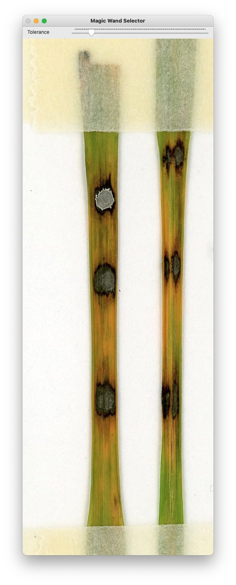

## hsvfinder

Reporting HSV values in flood filling masked areas.

Displays an image with a tolerance trackbar. A user can click anywhere on the image to seed a selection, where the range of allowable deviation from a colour is given by the trackbar value. The size of the selected region is shown in the terminal window



```sh
Select new areas to update or Press [q] or [esc] in the preview to close the window.
Click to seed a selection.
 * [SHIFT] adds to the selection. * [ALT] subtracts from the selection. * [SHIFT] + [ALT] intersects the selections.
 * Tolerance slider changes range of colours included by magic wand

Pixels in Selected Area = 964
```

## Getting Started

Install into a conda env from PyPI 

```sh
$ conda activate <my-env>
(my-env) $ pip install hsvfinder
```

or from GitHub

```sh
$ conda activate <my-env>
(my-env) $ pip install git+https://github.com/TeamMacLean/hsvfinder
```

Run the module as a script on any image you want:

```sh
(venv) $ python -m hsvfinder path/to/image.jpg
```

## Usage

As a script, just run the module directly as above. You can always check the `--help` flag when running the module as a script for more info:

```sh
(venv) $ python -m hsvfinder --help
usage: HSV magic wand selector [-h] [-s] image

positional arguments:
  image           path to image

optional arguments:
  -h, --help      show this help message and exit
  -s, --show_hsv  show a HSV stat summary.

```

